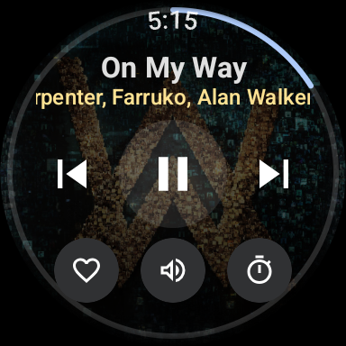
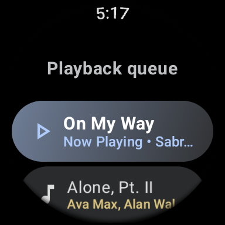
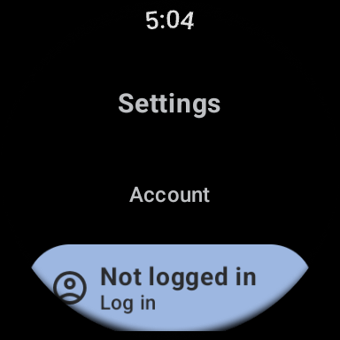
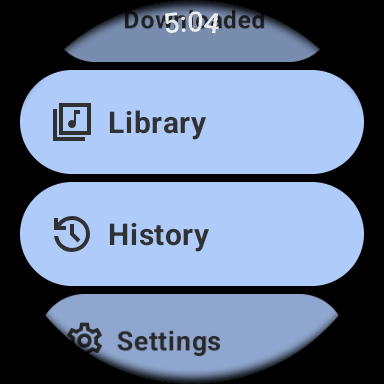
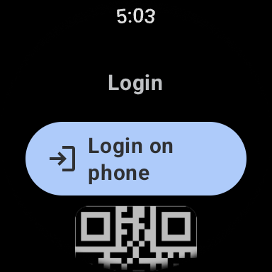

# Metrolist for Wear OS ⌚

### YouTube Music client for your wrist

 

 

Metrolist para Wear OS es una experiencia musical completa e independiente. Diseñada específicamente para pantallas circulares, te permite llevar toda tu biblioteca de YouTube Music en tu reloj sin depender constantemente de tu teléfono.

---

<h1>Screenshots</h1>

---

<h1>Features</h1>

<table>
  <tr>
    <td width="50%" valign="top">

#### 🎵 Reproducción Independiente
- Control total: Play, Pausa, Siguiente y Anterior.
- Anillo de progreso circular interactivo.
- Soporte para corona rotativa (scroll y volumen).
- Temporizador de sueño integrado.

</td>
    <td width="50%" valign="top">

#### ☁️ Sincronización y Cuenta
- **Login Independiente:** Inicia sesión directamente desde el reloj con código QR.
- Sincronización completa de biblioteca (Canciones, Álbumes, Artistas).
- Acceso a tus "Me gusta" y al Historial.

</td>
  </tr>
  <tr>
    <td width="50%" valign="top">

#### 💾 Modo Offline
- Descarga canciones directamente al reloj.
- Escucha tu música sin conexión a internet o sin el teléfono cerca.
- Gestión de almacenamiento desde el menú de opciones.

</td>
    <td width="50%" valign="top">

#### 🎨 Interfaz Material 3
- UI optimizada para Wear OS con componentes Glimmer.
- Animaciones fluidas y soporte para texto en movimiento (Marquee).
- Optimización para ahorro de batería.

</td>
  </tr>
</table>

---

<h1>Instalación</h1>

Puedes obtener el APK para Wear OS desde la sección de **Releases** de este repositorio. Para instalarlo, puedes usar `adb install` o herramientas como Bugjaeger.

---

<h1>Disclaimer</h1>

Este proyecto no está afiliado, autorizado ni respaldado por YouTube o Google LLC. Es un cliente de código abierto creado por la comunidad.

---

**Made with ❤️ for the Wear OS community**

